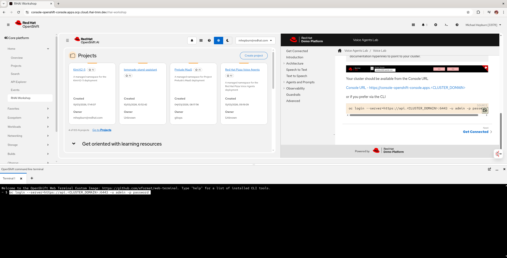

# RHAI Workshop Console Plugin

On a 4.10+ OpenShift cluster, deploy this dynamic console plugin.

See [CLAUDE.md](CLAUDE.md) for more details.

Install using a GitOps approach and kustomize:

```bash
oc apply -k ./gitops --server-side --force-conflicts
```

Or manually

```bash
oc process -f template.yaml \
  -p PLUGIN_NAME=rhai-workshop-plugin \
  -p NAMESPACE=rhai-workshop-plugin \
  -p IMAGE=quay.io/eformat/rhai-workshop-plugin:latest \
  | oc create -f -
```

```bash
oc patch consoles.operator.openshift.io cluster \
  --patch '{ "spec": { "plugins": ["rhai-workshop-plugin"] } }' --type=merge
```

To configure/change the tutorial:

```yaml
kind: ConfigMap
apiVersion: v1
metadata:
  name: workshop-config
  namespace: rhai-workshop-plugin
  labels:
    app: rhai-workshop-plugin
    app.kubernetes.io/part-of: rhai-workshop-plugin
data:
  tutorialUrls: |
    [
      {"name": "Voice Agents", "url": "https://eformat.github.io/voice-agents/voice-agents/index.html"},
      {"name": "Rainforest", "url": "https://eformat.github.io/rainforest-docs"}
    ]
```

and then restart pod.

```bash
oc rollout restart deployment/rhai-workshop-plugin -n rhai-workshop-plugin
```



## Build image locally

You can build it locally using:

```bash
yarn install
podman build -t quay.io/eformat/rhai-workshop-plugin:latest .
podman push quay.io/eformat/rhai-workshop-plugin:latest
```
